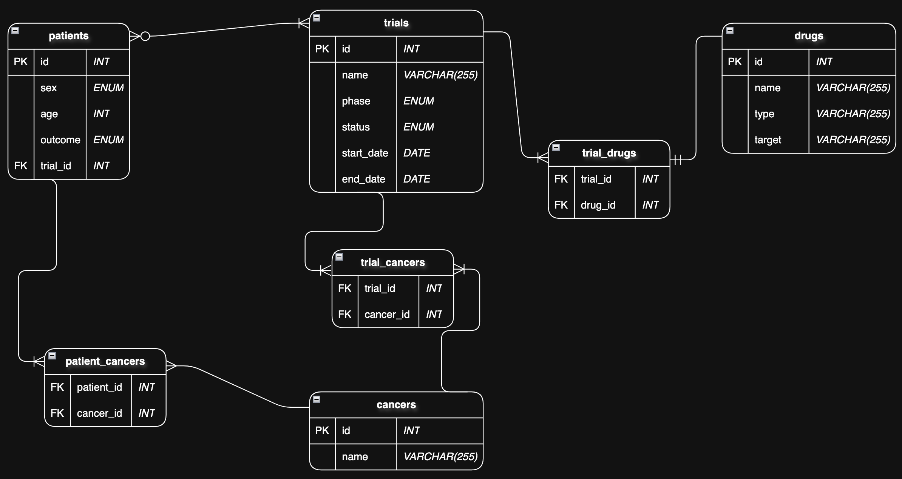

# Cancer Trial Drug Tracker

A relational MySQL database designed to track cancer drug trials across multiple cancer types — enabling researchers, clinicians, and data analysts to quickly answer questions such as:

- Which drugs were tested in which trials?
- What cancers were targeted?
- How many patients achieved complete response?
- Which drugs were associated with those responses?

> Final project for Harvard’s [CS50's Introduction to Databases with SQL](https://cs50.harvard.edu/sql).

---

## Project Files

  ```
  cancer-trial-drug-tracker/
  ├── schema.sql          # Full database schema
  ├── queries.sql         # Example SQL queries
  ├── diagram.png         # Entity Relationship Diagram (ERD)
  └── README.md           # This documentation
  ```

---

## Schema Overview

The database includes the following key entities:

| Table            | Description |
|------------------|-------------|
| `patients`       | Patient sex, age, response outcome, and trial enrolled |
| `trials`         | Clinical trial metadata: name, phase, status, dates |
| `drugs`          | Drug name, type (e.g., TKI, mAb), and target |
| `cancers`        | Cancer types (e.g., breast, lung, prostate) |
| `trial_drugs`    | Links trials and drugs (many-to-many) |
| `trial_cancers`  | Links trials and cancers (many-to-many) |
| `patient_cancers`| Links patients and cancers (many-to-many) |

---

## Relationships



- **One-to-Many**: Each patient is enrolled in one trial.
- **Many-to-Many**:
  - Trials ↔ Drugs
  - Trials ↔ Cancer types
  - Patients ↔ Cancer types

---

## Sample Queries

```
-- Trials using the drug 'Nivolumab'
SELECT trials.name
FROM trials
JOIN trial_drugs ON trials.id = trial_drugs.trial_id
JOIN drugs ON drugs.id = trial_drugs.drug_id
WHERE LOWER(drugs.name) = 'nivolumab';
```

```
-- Patients with Complete Response and drugs they received
SELECT patients.id, drugs.name
FROM patients
JOIN trial_drugs ON patients.trial_id = trial_drugs.trial_id
JOIN drugs ON drugs.id = trial_drugs.drug_id
WHERE patients.outcome = 'Complete Response';
```

More queries can be found in queries.sql.

---

## Functional Highlights
- Query which trials use specific drugs
- Retrieve all cancer types targeted by a given trial
- List patients and outcomes by clinical trial
- View drugs given to patients with complete response
- Indexes added for performance on large joins

---

## Index Optimizations

To speed up frequent join operations, the following indexes were created:

```sql
CREATE INDEX search_all_drugs_in_a_trial ON trial_drugs(trial_id);
CREATE INDEX search_all_trials_using_a_drug ON trial_drugs(drug_id);
CREATE INDEX search_all_cancers_in_a_trial ON trial_cancers(trial_id);
CREATE INDEX search_all_trials_for_a_cancer ON trial_cancers(cancer_id);
CREATE INDEX search_all_cancers_for_a_patient ON patient_cancers(cancer_id);
```

---

## Limitations & Future Directions
- No support for clinical site or sponsorship tracking
- No adverse event or dosage data
- Omits genomic or biomarker-level details
- Could be expanded with:
- Treatment arms / regimens
- Adverse event logging
- Integration with public APIs (e.g. ClinicalTrials.gov)

---

## How to Use

1.	Import schema:
```bash
mysql -u your_username -p < schema.sql
```

2.	Run queries:
```bash
mysql -u your_username -p your_database < queries.sql
```

You’ll need MySQL installed and running locally.

---

## What I Learned
- Database schema design for real-world biomedical data
- Modeling complex many-to-many relationships
- Query optimization and indexing
- Writing reusable, insightful SQL queries

---


